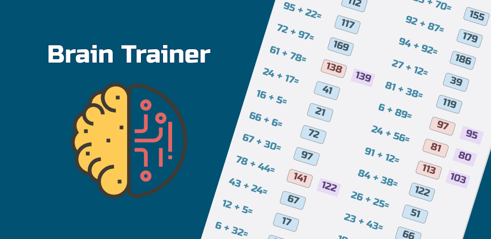

# Brain Trainer

## Description 
Solve simple arithmetic expressions as quickly as possible. Choose from four types of operations with two operands. Track your time or enjoy at your own pace.
Brain Trainer is my pet application started with permission to go through all the steps of developing application suitable for distribution at Google Play. At the same time, it became for me a best practice tool for improving my knowledge of Android and trends in application production. At now it is on stage on close beta testing, and if you want to join my testing team, you may contact me directly.
Also, the last build of the application you can download [from Google Store](https://play.google.com/store/apps/details?id=main.work.braintrainercompose&hl=en-US&ah=sImgtVDKPHcPNvFao_Abe6AyElw) or [APK file](https://github.com/smitford/BrainTrainer/blob/master/app-release.apk)

## Device requerment
Compatible from Android 8 (Android API 26)

## App features

### Mental arithmetic simulator
This screen containse a randomly genereted list of arithmetic expressions. User can easyly configer simulation settings by tapping the menu icon in the top right corner of the screen. Posibile adjustments include:
 - **Difficulty levels**
 - **Arithmetic expression type**
 - **Simulation types**.

Users can also turn on tracking of game results. If tracking is on, users will have the option to save their results after compliteing the calculations.

https://github.com/smitford/BrainTrainer/assets/17237585/bec7e65c-f847-4e62-bb8f-2f8a39521877

### Results treacking
There is accumulated information on all tracked sessions. Information is divided into tables based on the type of simulation sessions: free simulation without time tracking, time tracked, and time race.

https://github.com/smitford/BrainTrainer/assets/17237585/4981fb42-7781-4490-9614-446bcb4ce79e

### General application settings
Screen include:
- Dark/light theme swithcer
- Link on privacy policy
- Application sharing button

https://github.com/smitford/BrainTrainer/assets/17237585/10c3a3d1-b665-4f40-bfb2-659f1fcfd926

## Technology stack
Kotlin, Clean Architecture, MVVM, Jatpack Compose, Navigation Compose, Room, Koin, Gson, Kotlin Coroutines, Webkit
